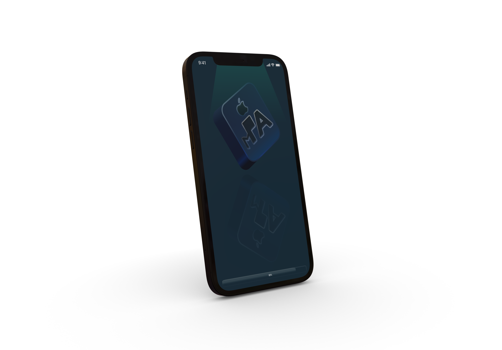
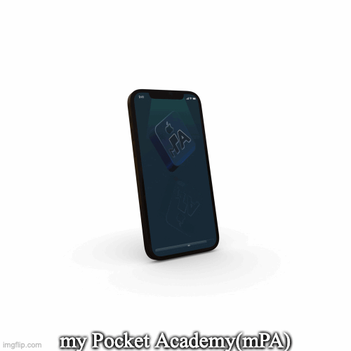

# My-PA-App
This is my final year project on iOS app Development. mPA app (My Pocket Academy) to manage college assignments/tutorial and circulate notice to particular targeted group in well manner by creating a simple User Interface.... 
App is based on FIREBASE data model.
(under progress..)

 
